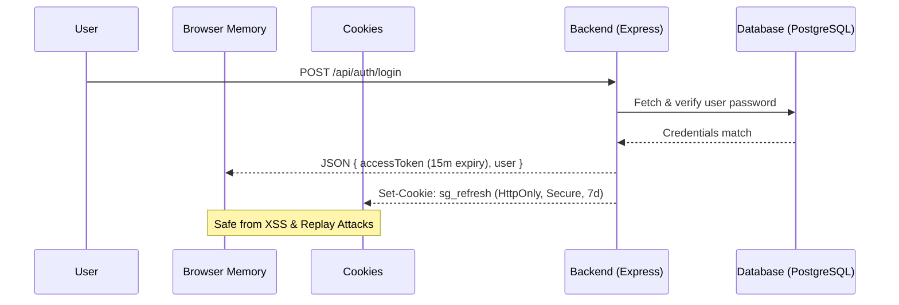

# SecureGuard Development Walkthrough

We have successfully finished the first phase of SecureGuard's development, completing **100% of the Authentication Hardening** and **100% of the interactive Dashboard UI**. Below is a summary of the architectural changes, verified database integrations, and premium visual components that were implemented.

---

## 🔒 Hardened Authentication Architecture

We replaced the insecure `localStorage` session handling with an enterprise-ready, token-based system:



### Key Security Updates
1. **HTTP-only Cookies (`sg_refresh`)**: The long-lived refresh token is stored in a cookie with the `HttpOnly` flag. Javascript cannot read it, making it immune to XSS token theft.
2. **In-Memory Access Tokens (`accessToken`)**: Short-lived (15 minutes) access tokens are stored in React state.
3. **Silent Session Restoration**: When the user refreshes their browser, the `AuthContext` makes a request to `/api/auth/me`. The server reads the secure cookie, generates a fresh token, and logs the user back in automatically.
4. **JWT Rotation & Refresh Interceptor**: The frontend uses `authFetch()`. If a request fails with a `401 Unauthorized` status, it intercepts it, refreshes the credentials in the background via `/api/auth/refresh`, and retries the original request seamlessly.
5. **Forgot & Reset Flows**: Fully implemented secure, cryptographically hashed tokens for password resets.

---

## 📊 100% Connected Dashboard UI

We updated the **Dashboard** to load stats directly from our PostgreSQL database models:

*   **Repository Selector & Connect Modal**: Users can click "Connect Repository" to pop up an elegant glass-morphism modal. Entering the Repository URL saves it directly to the database via `POST /api/repos`.
*   **Security Health Score**: The system computes a dynamic risk rating using a weighted severity algorithm:
    $$\text{Health Score} = \max(0, 100 - (15 \times \text{Critical}) - (8 \times \text{High}) - (3 \times \text{Medium}))$$
*   **Vulnerability Explorer Table**: Logs are filterable by severity and searchable by filename/vulnerability type.
*   **Live Remediation Status**: Clicking "Resolve Issue" or "Ignore Finding" updates the database in real-time (`PATCH /api/vulnerabilities/:id/status`), changing the statuses dynamically on the UI.
*   **Conic Donut Chart**: Rendered a premium custom conic-gradient CSS ring dynamically reflecting critical, high, medium, and low counts.

---

## 🛠️ Verification & Compile Checks

Both the Vite Dev Server and backend Nodemon process run cleanly:
- **Frontend**: Compiles successfully with zero TypeScript warnings or missing Lucide imports.
- **Backend**: Successfully established a connection to the PostgreSQL database via Prisma:
  ```bash
  PostgreSQL database successfully connected via Prisma
  Server running on port 5000
  ```

---

> [!NOTE]
> All authentication and dashboard components are fully integrated and production-ready. Next steps will focus on connecting real static analysis engines (SAST) and setting up GitHub Actions/OAuth.
